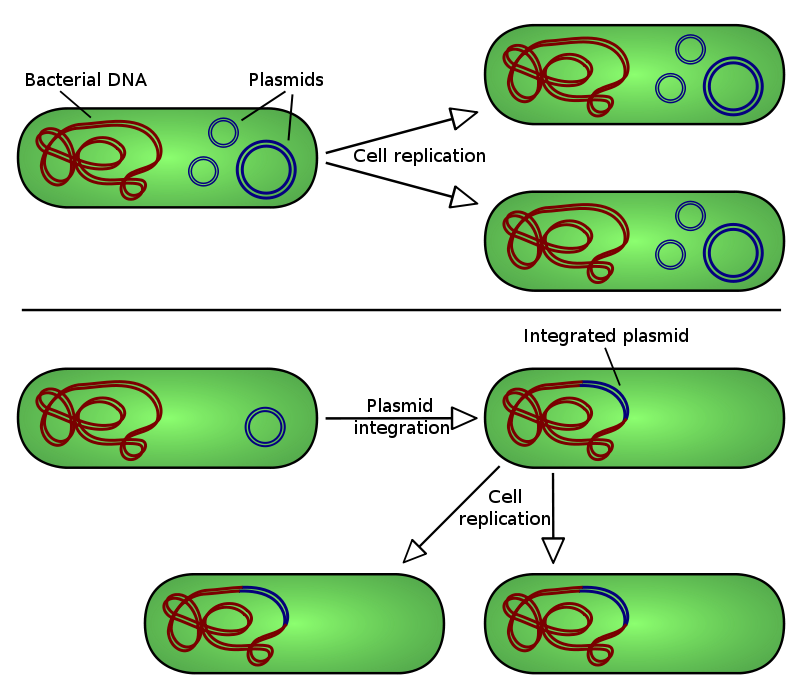

# Mapping and Variant Calling

In this practical you will learn to map NGS reads to a reference sequence, check the output using a viewer software and investigate some aspects of the results.
You will be using the read data from the [Quality Control](qc.md) practical.

EHEC O157 strains generally carry a large virulence plasmid, pO157.
Plasmids are circular genetic elements that many bacteria carry in addition to their chromosomes.
This particular plasmid encodes a number of proteins which are known or suspected to be involved in the ability to cause severe disease in infected humans.
Your task in this practical is to map your prepared read set to a reference sequence of the virulence plasmid, to determine if the pO157 plasmid is present in the St. Louis outbreak strain.

---

*Illustration of plasmid integration into a host bacteria*
---

## Downloading a Reference

You will need a reference sequence to map your reads to.

```bash
cd ~/work
curl -O -J -L https://osf.io/rnzbe/download
```

This file contains the sequence of the pO157 plasmid from the Sakai outbreak strain of E. coli O157.
In contrast to the strain we are working on, this strain is available as a finished genome, i.e. the whole sequence of both the single chromosome and the large virulence plasmid are known.

### Indexing the reference

Before aligning the reads against a reference, it is necessary to build an index of that reference

```bash
bowtie2-build pO157_Sakai.fasta.gz pO157_Sakai
```

!!! note
    Indexing the reference is a necessary pre-processing step that makes searching for patterns much much faster. Many popular aligners such as Bowtie and BWA use an algorithm called the [Burrows–Wheeler transform](https://en.wikipedia.org/wiki/Burrows–Wheeler_transform) to build the index.

### Aligning reads

Now we are ready to map our reads

```bash
bowtie2 -x pO157_Sakai -1 SRR957824_trimmed_R1.fastq \
    -2 SRR957824_trimmed_R2.fastq -S SRR957824.sam
```

The output of the mapping will be in the SAM format.
You can find a brief explanation of the SAM format [here](file_formats.md)

!!! note
    In this tutorial as well as many other places, you'll often see the terms *mapping* and *alignment* being used interchangeably. If you want to read more about the difference between the two, I invite you to read this excellent [Biostars discussion](https://www.biostars.org/p/180986/)

### Visualising with tview

```bash
head SRR957824.sam
```

But it is not very informative.
We'll use samtools to visualise our data

Before downloading the data in tablet, we have to convert our SAM file into BAM, a compressed version of SAM that can be indexed.

```bash
samtools view -hSbo SRR957824.bam SRR957824.sam
```

Sort the bam file per position in the genome and index it

```bash
samtools sort SRR957824.bam -o SRR2584857.sorted.bam
samtools index SRR2584857.sorted.bam
```

Finally we can visualise with `samtools tview`

```bash
samtools tview SRR2584857.sorted.bam pO157_Sakai.fasta.gz
```

!!! tip
    navigate in tview:  
        - left and right arrows scroll    
        - `q` to quit   
        - `CTRL-h` and `CTRL-l` scrolls more  
        - `g gi|10955266|ref|NC_002128.1|:8000` will take you to a specific location.   

### Variant Calling

A frequent application for mapping reads is variant calling, i.e. finding positions where the reads are systematically different from the reference genome.
Single nucleotide polymorphism (SNP)-based typing is particularly popular and used for a broad range of applications.
For an EHEC O157 outbreak you could use it to identify the source, for instance.

We can call the variants using `samtools mpileup`

```bash
samtools mpileup -uD -f pO157_Sakai.fasta.gz SRR2584857.sorted.bam | \
    bcftools view - > variants.vcf
```

You can read about the structure of vcf files [here](file_formats.md).
The documentation is quite painful to read and take a look at the file

Look at the non-commented lines

```bash
grep -v ^## variants.vcf
```
The first five columns are *CHROM POS ID REF ALT*.

Use

```bash
grep -v ^## variants.vcf | less -S
```

for a better view.

!!! tip
    Use your left and right arrows to scroll horizontally, and `q` to quit.


!!! question
    How many SNPs did the variant caller find? Did you find any indels?

Examine one of the variants with tview

```bash
samtools tview SRR2584857.sorted.bam pO157_Sakai.fasta.gz \
    -p 'gi|10955266|ref|NC_002128.1|:43071'
```

That seems very real!

!!! question
    Where do reference genomes come from?
