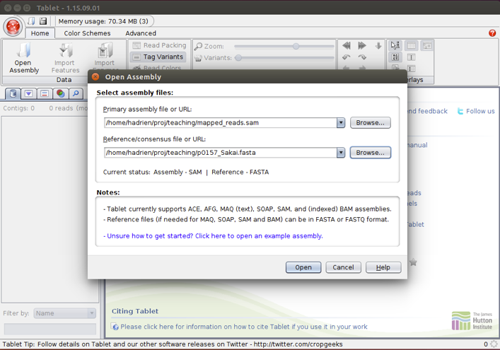
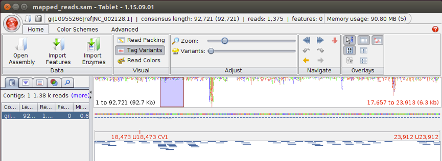
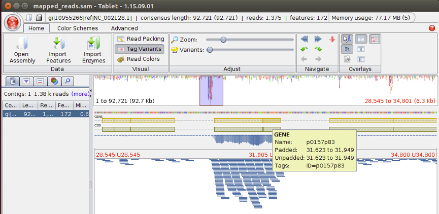

# Mapping and variant calling

In this practical you will learn to map NGS reads to a reference sequence, check the output using a viewer software and investigate some aspects of the results. You will be using the read data from the [Quality Control](qc.md) practical.

EHEC O157 strains generally carry a large virulence plasmid, pO157. Plasmids are circular genetic elements that many bacteria carry in addition to their chromosomes. This particular plasmid encodes a number of proteins which are known or suspected to be involved in the ability to cause severe disease in infected humans. Your task in this practical is to map your prepared read set to a reference sequence of the virulence plasmid, to determine if the pO157 plasmid is present in the St. Louis outbreak strain.

## Read mapping

### downloading a reference

You will need a reference sequence to map your reads to. You can download the reference from [here](data/pO157_Sakai.fasta)

or from the command-line with

`wget https://raw.githubusercontent.com/HadrienG/tutorials/master/data/pO157_Sakai.fasta`

This file contains the sequence of the pO157 plasmid from the Sakai outbreak strain of E. coli O157. In contrast to the strain we are working on, this strain is available as a finished genome, i.e. the whole sequence of both the single chromosome and the large virulence plasmid are known.

### indexing the reference

Before aligning the reads against a reference, it is necessary to build an index of that reference:

```
module load bowtie2
bowtie2-build pO157_Sakai.fasta pO157_Sakai
```

### aligning reads

`bowtie2 -x pO157_Sakai -1 reads_1.fastq -2 reads_2.fastq -S output.sam`

The output of the mapping will be in SAM format. you can find a brief explanation of the SAM format [here](files_formats.md)

### visualising the alignment

To view the outcome of the read mapping, we will use a program called Tablet, that can be run without administrated privileges. Download it [here](https://ics.hutton.ac.uk/tablet/).

Start the program and select Red Button – Open. Choose your SAM-file and pO157_Sakai.fasta as a reference.



Select the only contig to the left.



Next, download pO157_Sakai.gff from [here](data/pO157_Sakai.gff). Select import features in Tablet and import pO157_Sakai.gff. This file contains annotations, i.e. what is encoded in each part of the DNA sequence. Two tracks (CDS + GENE) will be added.

Navigate the mapping using the zoom and pan left/right etc. Under Colour schemes you can highlight bases that do not match the reference. Holding your pointer over a CDS will show you a description of the genetic region.



Does the mapping data confirm the presence of an intact pO157 plasmid in the St. Louis outbreak strain?

You will note that one region has extremely high coverage. This region corresponds to two adjacent CDSs

Check their identity, what do they have in common?

Extract the sequence of the biggest of these two by right-clicking on it and selecting copy reference subsequence to clipboard

Your read data was from the whole genome, but you are only mapping to a reference for the pO157 plasmid. Go to BLAST and use nucleotide BLAST to check if the problematic region is present on the chromosome of the reference strain Sakai (BA000007.2) using the Align two sequences option with your subsequence copied from Tablet and BA000007.2. You don’t have to enter the whole genome sequence, just the code.


How many matches do you find on the chromosome?

Why do you think the coverage is so high for this region in the mapping to the pO157 reference?

## Variant Calling

A frequent application for mapping reads is variant calling, i.e. finding positions where the reference and your sequences differ. Single nucleotide polymorphism (SNP)-based typing is particularly popular and used for a broad range of applications. For an EHEC O157 outbreak you could use it to identify the source, for instance. Indels are insertions and deletions in the mapped data compared to the reference.

You could find SNPs by just staring at the alignment in Tablet. A variant caller is a program that automates this process, finding variable positions anywhere in the sequence and weighing the evidence for a true variant (number of reads agreeing, quality of those reads etc.) We will be using SAMtools for variant calling.

### Sorting and indexing a bam file

First you need to sort the reads in the BAM-file so the variant caller can easily find the relevant ones for a given position in the reference sequence.

You may need to convert your sam file into a bam file first:

`samtools view -bS -o $output.bam $input.sam`

then sort and index the bam file:

```
samtools sort $output.bam > $output_sorted.bam
samtools index $output_sorted.bam
```

Now we can perform the SNP and Indel calling:

`samtools mpileup -o output.vcf -f pO157_Sakai.fasta test_sorted.bam`

You can read about the structure of vcf files here

How many SNPs did the variant caller find? Did you find any indels?

Each variant in the vcf comes with a lot of different quality metrics from the variant calling process. The “QUAL” column tells you how confident the variant caller is feeling about that variant.

Use the coordinates from the vcf-file and manually check a high quality SNP and a low quality SNP in your Tablet view of the sam file. (Hint: there is a “Jump to base” button that can make it easier for you.)

If you have time:
Read the original paper about the St. Louis outbreak investigation, in particular check the supplemental material and methods to see how the authors performed read mapping and variant calling.
